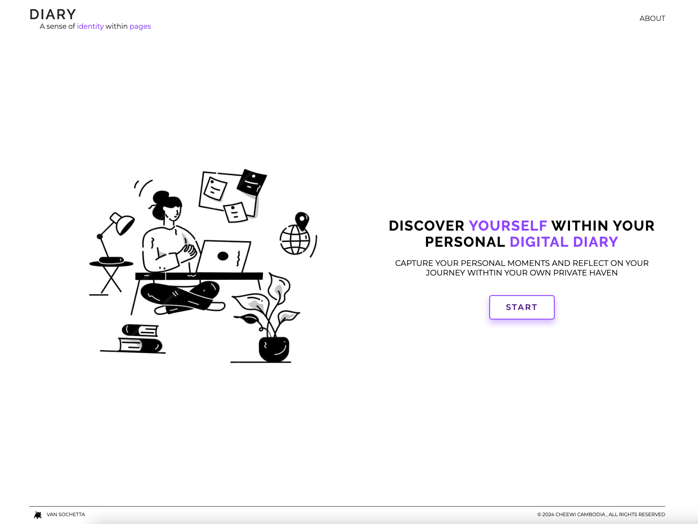

## TECH STACK FOR WEB DIARY APPLICATION DEVELOPMENT 


## RESOURCES AND OTHER INFORMATION RELATED TO THE WEBSITE 

[WEB DIARY APPLICATION STYLE GUIDE](https://www.notion.so/PROJECT-DETAILS-AND-STYLE-GUIDE-cc4c1cfde86e413582548d9e461356e6)

[WEB DIARY APPLICATION CONVENTION GUIDE](https://www.notion.so/CONVENTION-GUIDE-9a29ca0dc6264375af69f466e6ad55c9)

[WEB DIARY APPLICATION HAND BOOK (CONTAINING IA AND FIGMA)](https://www.notion.so/PROJECT-HANDBOOK-b9a686ec568343ff984c529fc9c31904)

[DEPLOYED WEBSITE](https://web-diary-red.vercel.app/index.html)


## FOLDER STRUCTURE FOR WEB DIARY APPLICATION DEVELOPMENT 
```
diary-web-application/
├── .vscode/  
├── asset/  
│   ├── footer/  
│   ├── homepage/  
│   ├── landing-page/ 
│   ├── ...  
├── component/ 
│   ├── card-component/  
│   ├── common-components/  
│   ├── ...  
├── pages/  
│   ├── home.html  
│   ├── login.html  
│   ├── ...  
├── src/  
│   ├── fonts/  
│   ├── script/  
│   ├── style/  
├── .gitignore  
├── reviewboardrc 
├── index.html  
└── README.md  
```

## HOW TO USE THE WEBSITE


### FIRST STEP



The first page of the website is the landing page, which is the greeting page for general users. Pages that can be accessed from the landing page is the about page, and the homepage. 

- About page : To access the about page, click the about on the right hand side of the navigation bar
- Homepage : To access the homepage, click the start button and you will be directed to the homepage

### SECOND STEP


The second page of the website is the homepage , where you can create your Diary entries and start your journey. The pages that can be accessed from the homepage are the Landing page and About page. 

- About page : To access the about page, click the about on the right hand side of the navigation bar
- Landing page : To access the landing page, click the Logo on the left hand side of the navigation bar

### THIRD STEP

In order to create a Diary Entry in the landing page, click the purple plus button 


Fill in all your information relating to the Diary Entry including : 

- Diary Title
- Diary Content
- Diary Date

Then click the Add Button in order to add the Diary Entry onto your list of Entries 

### FOURTH STEP


Once saved , your Diary Entry will display on the right hand side as a list where you can see the review of all the cards. The functionalities of the Diary Application include the ability to : 

- Read the full content of the card
- Edit the card
- Delete the Card

### FIFTH STEP :

#### READING THE CARD


In order to Read the full contents of the Diary Entry card, click the Purple read button , where the full contents of the card will display as such 


#### EDITING THE CARD


In order to edit the Diary Entry card, click the green edit button , where the edit card will display as such , and you will be able to update your Diary card’s Title, Content and Date


#### DELETING THE CARD


In order to Delete the Diary Card, click the red delete button , and the card will be deleted from your lists of Diary Entires 

### SIXTH STEP

If you navigate to the left hand side of the page, then you will see the dashboard, recording your : 

- Total Diary Card
- Weekly Diary Card
- Monthly Diary Card

